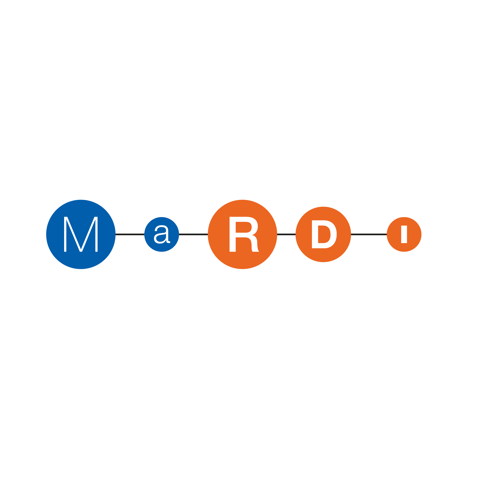
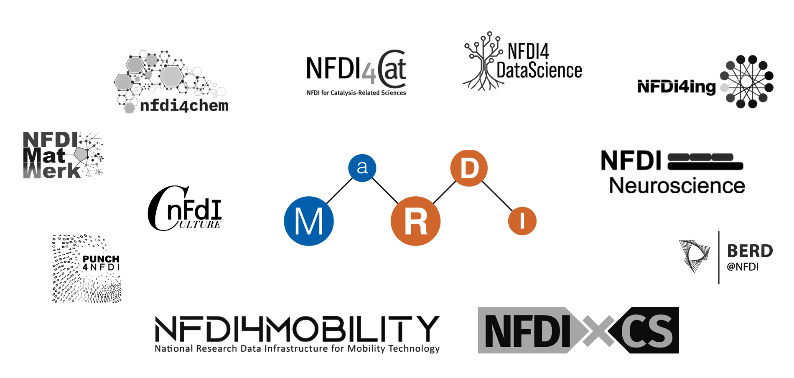
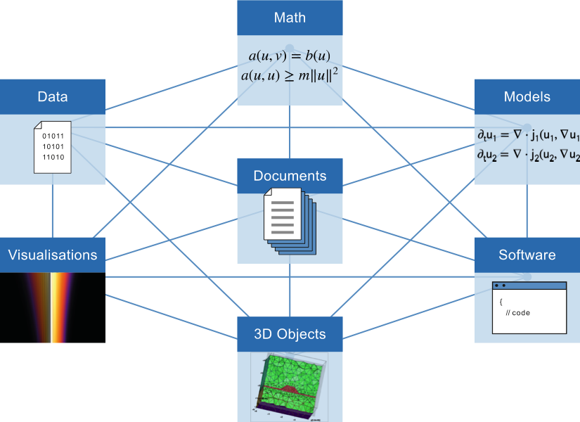
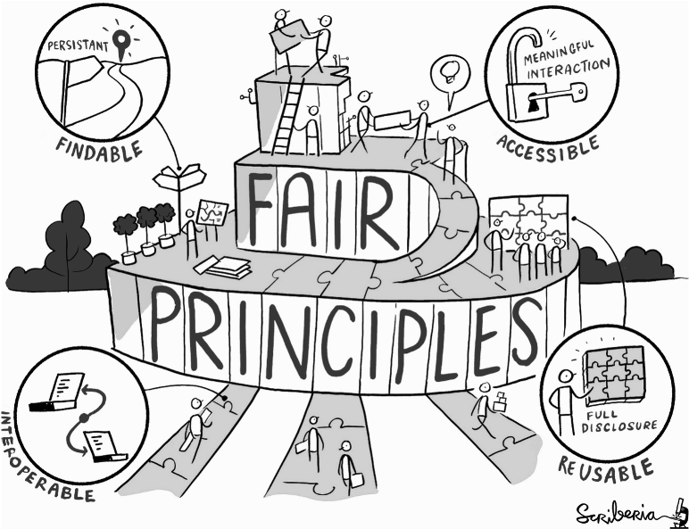
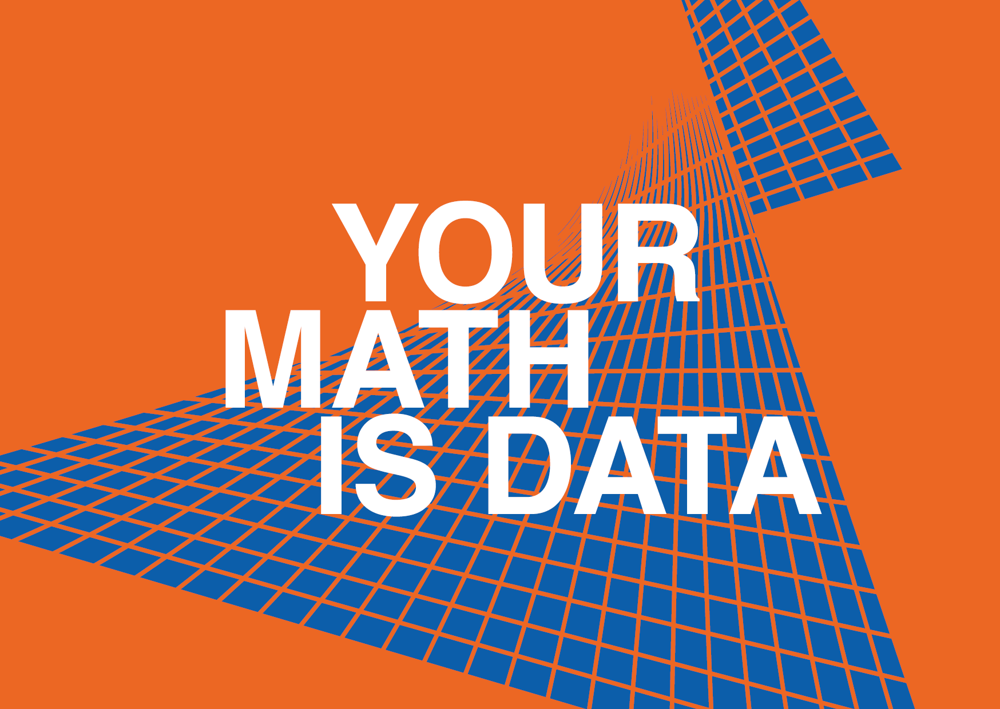
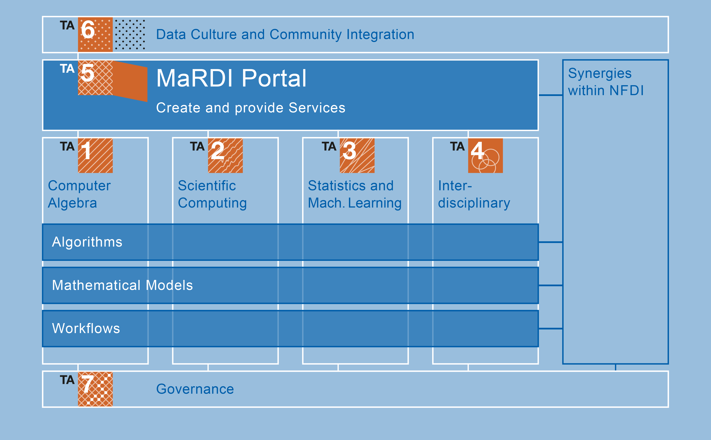
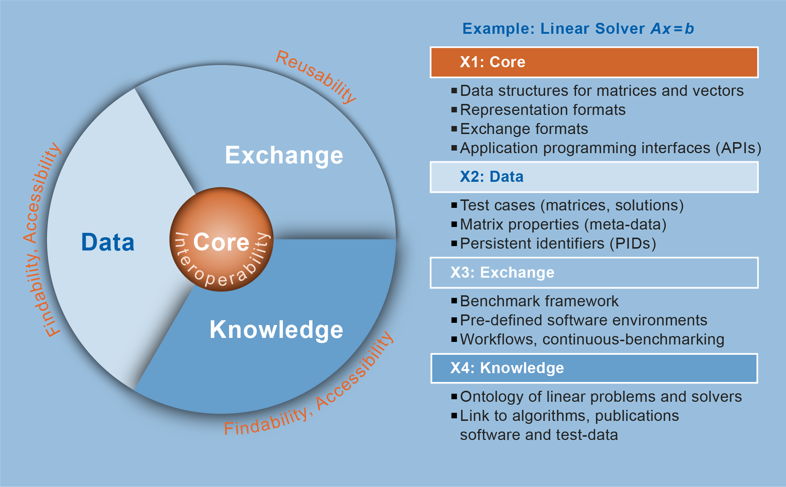
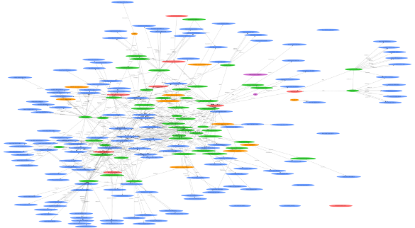

```{r setup, include=FALSE}
options(htmltools.dir.version = FALSE)
knitr::opts_chunk$set(
  fig.width=9, fig.height=3.5, fig.retina=3,
  out.width = "100%",
  cache = FALSE,
  echo = TRUE,
  message = FALSE, 
  warning = FALSE,
  hiline = TRUE
)
```

```{r xaringan-themer, include=FALSE, warning=FALSE}
library(xaringanthemer)

dark_yellow <- "#EFBE43"
light_yellow <- "#FDF7E9"
gray <- "#333333"
blue <- "#4466B0"

style_duo_accent(primary_color = "#3070b3",
          secondary_color = dark_yellow,
          # fonts
          header_font_google = google_font("Martel"),
          text_font_google = google_font("Lato"),
          code_font_google = google_font("Fira Mono"))

```


class: title-slide

 ## Mathematical Research Data Initiative
<br>

.pull-left[
<div class="bottom">
<p>  Stephan Haug</p>
<p> Technical University of Munich </p>
</div>
]

.pull-right[

]


---

layout: true

background-image: url(figures/MaRDI_Logo.png)
background-position: 96.7% 4.3%
background-size: 15%

---

### MaRDI within the 

<br>

```{r,echo=FALSE}

```


???

MaRDI is part of the German national research-data infrastructure, short NFDI. The NFDI has 90mio euros of funding over ten years. Its aim is to establish the FAIR principles across science – see the next slide and following. In order to do this, in three calls a total of thirty consortia in all data-intense sciences receive funding. MaRDI has partner consortia in chemistry, computer science, economics, and the egineering sciences, for instance. Here we see the logos of all consortia MaRDI has or will have collaboratioons with. Some of us also take part in NFDI4Ing, our mentoring consortium, or BERD@NFDI.

References
NFDI funding volume: https://www.dfg.de/download/pdf/foerderung/programme/nfdi/one_pager_nfdi_de.pdf 2021
Partner: see MaRDI proposal 2021, case studies TA4; e.g. Dorothea Iglezakis is with NFDI4Ing and MaRDI TA4, Bernd Bischl is with BERD@NFDI and TA3.


---

### Research data in mathematics

.pull-left-60[
```{r, echo=FALSE}
  
```
]

.pull-right-40[

.content-box-grey[
__Aim __of the .yb[NFDI] is

+ to systematically __catalogize research data__ resulting from publicly funded research, to secure these for the future and make them __findable__ and __accessible__

+ to develop and __establish standards in research-data management__ and guarantee the (inter-)national linkage of research data

]


]

.small[Nathalie Hartl, Elena Wössner, and York Sure-Vetter. [Nationale Forschungsdateninfrastruktur (NFDI)](https://link.springer.com/article/10.1007/s00287-021-01392-6). _Informatik Spektrum_, 44(5):370–373, 2021.
]
???

In order to understand what we mean by “building research-data infrastructure according to the FAIR principles”, let’s have a look at the individual words in this sentence first. Research data are “all digital objects that arise in the process of doing research or are a result thereof”, according to the definition of Kindling and Schumacher, 2013. In mathematics, these are for instance mathematical documents, notebooks, domain-specific research-software packages and libraries, computer algebra systems, programmes, scripts, simulation data, formalised mathematics, collections of mathematical objects, and mathematical models. See the illustration on the left-hand side. The NFDI plans to build up an infrastructure for all of these… [itemization on the slide]

References
Definition research data: Kindling, Maxi und Schirmbacher, Peter: „Die digitale Forschungswelt“ als Gegenstand der Forschung. Information – Wissenschaft – Praxis 64 (2013): S. 130. doi.org/10.1515/iwp-2013-001, 
See also https://www.forschungsdaten.info/themen/informieren-und-planen/was-sind-forschungsdaten/
Illustration: https://www.mardi4nfdi.org/fileadmin/_processed_/8/b/csm_MaRDI_Mission_MathResData_web_6bb280d6a8.png
Research data in math: MaRDI proposal 2021, itemization on page 26.

---

### FAIR research data

.pull-left-60[

```{r, echo=FALSE}

```

]

.pull-right-40[
Mark Wilkinson, Michel Dumontier, IJsbrand Jan Aalbersberg,  Gaby Appleton, et al. [The FAIR guiding principles for scientific data management and stewardship](https://www.nature.com/articles/sdata201618). _Scientific Data_, 3 (160018), 2016.

Annika   Jacobsen,   Ricardo   de   Miranda  Azevedo,  Nick  Juty,  Dominique Batista,  Simon  Coles,  Ronald  Cornet, Mélanie Courtot, Mercè Crosas, Michel Dumontier, et al. [FAIR principles: Interpretations and implementation considerations](https://direct.mit.edu/dint/article/2/1-2/10/10017/FAIR-Principles-Interpretations-and-Implementation). _Data Intelligence_, 2(1-2):10–29, 2020.
]

???
The NFDI’s and MaRDI’s aims are based on the FAIR principles for sustainable research. Ideally, research data would be findable, accessible, interoperable, and reusable – both for the human user and for a machine. The two publications cited on this slide introduce these principles, interpret them, and discuss implementations. In particular, the following ideas are part of being FAIR.
Findability: data should be uniquely identifiable via a persistent identifier, be richly described by metadata, and indexed in a source that can be searched automatically.
Accessibility: metadata should be obtainable via the identifier and with the help of a standardised, open protocol. They continue to be findable even if the research data itself does not exist anymore. Authorization procedures can be automatized.
Interoperability: research data and metadata follow a formal language which is public and broadly applicable. Research data and metadata reference other relevant research data and their metadata.
Reusability: research data and metadata include clear license and provenance statements and meet relevant community standards.
This is all pretty high level up to this point, so we will see a couple of example on the next slides.

References
FAIR illustration: https://the-turing-way.netlify.app/_images/fair-principles.jpg “Available for free under a CC-BY licence. Please use and re-use whatever you need, for any purpose.”


---


### FAIR in mathematics

.pull-left-60[
.sbb[Status quo:]
+ missing quality badges and unclear peer-review processes for software

+ knowledge about algorithms (implementations, state of the art, publications) not available in one place

+ missing benchmarks for machine learning problems and the learning of graphical models

+ non-standardized workflows in interdisciplinary mathematics

+ limitations of [zbMATH](https://zbmath.org/) and [swMATH](https://swmath.org/)

+ …


]

.pull-right-40[

```{r, echo=FALSE}

```


.sbb[What is it that we can do?]

+ rise awareness and build infrastructure!


]

???

References
Examples: MaRDI proposal 2021, TA1, 2, 3, 4 und 5.
Illustration: MaRDI postcard, Thomas Endler TA6, 2022.


---


### .yb[Ma]thematical .yb[R]esearch .yb[D]ata .yb[I]nitiative

.pull-left-40[
+ kickoff November 2021

+ 15 institutions and partners

+ 1 out of 30 NFDI consortia

+ the .yb[one consortium of mathematics]

+ 28 (full-time equivalent) employees

+ 10 Mio. Euro of funding over five years


]


.pull-right-60[

```{r, echo=FALSE}
knitr::include_graphics("figures/MaRDI_cons.png")
```

]

.footnote[Funded by the Deutsche Forschungsgemeinschaft (DFG), 
Project number  460135501. 
NFDI 29/1 "MaRDI – Mathematische Forschungsdateninitiative"]


???

MaRDI wants to solve all the issues on the previous slide! This is what fifteen institutions and partners have teamed up to do, starting 2021. Main applicant for MaRDI has been the WIAS, TUB and TUK represent computer algebra, MPI DCTS and WWU scientific computing, LMU and TUM statistics and machine learning, UStutt and Fraunhofer ITWM interdisciplinary mathematics, FIZ and ZIB build the MaRDI Portal, UL, MFO and MPI MiS do the outreach. Partners are the EMS, GAMM, GOR and imaginary.
Here are some fact: … [itemization on the slide].

References
Data: Renita Danabalan, Q1/2022, in particular 27,5 positions +1 additional
DFG project number: https://gepris.dfg.de/gepris/projekt/460135501?context=projekt&task=showDetail&id=460135501&
How to cite MaRDI: Karsten Tabelow, 2022

---

### Divisions of the consortium
.center[
```{r, echo=FALSE, out.width="85%"}

```
]

_"MaRDI will have a unique twofold function within the mathematics community – as a quality-controlled mathematical research-data library and as a digital service portal at the same time."_  - Ilka Agricola, president of the German mathematical union, 2021


???

MaRDI is divided by data type into seven task areas. The four mathematical task areas are: computer algebra, scientific computing, statistics and machine learning, and cooperation with other disciplines. They are connected via common themes such as algorithms, mathematical models, and workflows. These four build the pillars of the MaRDI portal, a unique and central service portal for scientists which follows a wiki format. These task areas are rounded up by the WIAS, head of the consortium, and a team especially for data culture and outreach activities. 
The other NFDI consortia are often built in a similar manner (with a structure of task areas with related topics and use cases). This creates synergies within the NFDI.

References
Illustration: MaRDI proposal 2021
Quote: press release https://idw-online.de/en/news?print=1&id=772124

---

### One use case


```{r, echo=FALSE}

```


???

MaRDIs Dienst selbst sind in vier Schichten aufgebaut. Hier erklärt am Beispiel der Lösung eines Linearen Gleichungssystems Ax=b. Unser Kern/core besteht in der Gewährleistung der Interoperabilität von (Meta-)Datenformaten, -typen und Softwareschnittstellen. Das kann hier zum Beispiel bedeuten, dass MaRDI standardisierte Formate für die Repräsentation und Verwendung von A, x und b benutzt sowie Software für die Anwendung eines Lösers anbietet. F und A des FAIR-Ansatzes werden durch die “Data” Schicht adressiert, insbesondere durch die Integration von relevanten Forschungsdatenrepositorien in die MaRDI-Infrastruktur, welche durch den/die menschlichen Benutzer*in oder automatisiert abrufbar sind. Im Anwendungsfall sind das Repositorien, die konkrete Matrizen und Lösungen mit ihren jeweiligen Eigenschaften in standardisierten Formaten bereitstellen und die eine eindeutige ID haben. Die “Exchange” Schicht bietet innovative Datendienste an, hier Benchmarks für diese Löser um z.B. performance von Algorithmen vergleichen zu können. Die “Knowledge” Schicht wird von Ontologien und Knowledge graphen gebildet, die in einer festen Sprache zum Beispiel Algorithmen mit Publikationen, Autor*innen und Implementationen verlinken.

References
Text und Illustration: MaRDI proposal 2021, Seite 28ff.


---


### Work program of TA3

.yb[M3.1: Library of Curated Benchmark Datasets]    
.small[__Aim:__ provide _task-specific_ libraries of curated benchmark datasets following FAIR principles ]


.yb[M3.2: Library of Statistical Analyses]    
.small[__Aim:__ provide exhaustive statistical analysis of the datasets from M3.1, which will be demos that connect the data to statistical methods] 

.yb[M3.3: Empirical Analysis of Machine Learning Experiments]    
.small[__Aim:__ provide (tools to analyze) results of benchmark experiments of the datasets from M3.1; summarize common pitfalls and list guideline to avoid those pitfalls]

.yb[M3.4: Standards for Peer Review of Numerical Experimentation]     
.small[__Aim:__ establish standards for peer-review of numerical experiments as well as the software code with which the experiments are conducted]

---


### Services


```{r, echo=FALSE}
knitr::include_url("https://portal.mardi4nfdi.de/wiki/Portal", height = "500px")
```


---


### Services


A couple of the services, MaRDI will provide during its five-year runtime, are the following:

.pull-left[
+ Portal

+ knowledge graphs
  ```{r,echo=FALSE}
  
  ```


+ workshops and training

+ benchmarks

]

.pull-right[
+ peer-review standards and processes

+ quality badges for software workflows

+ interaction with other NFDI consortia


]


???


References
Screenshot Portal, 2022
Knowledge graph rendering: Christian Himpe, 2022
Picture Kickoff-Workshop: Thomas Endler, November 2021


---
class: inverse center, middle

# Thanks!


Slides are based on work from the     
Mathematical Data Consultant in MaRDI [Christiane Görgen](https://sites.google.com/view/goergen) 


<!--
<br>
.small[
and created via the R packages:

[**xaringan**](https://github.com/yihui/xaringan)<br>
[gadenbuie/xaringanthemer](https://github.com/gadenbuie/xaringanthemer)

]
--> 
