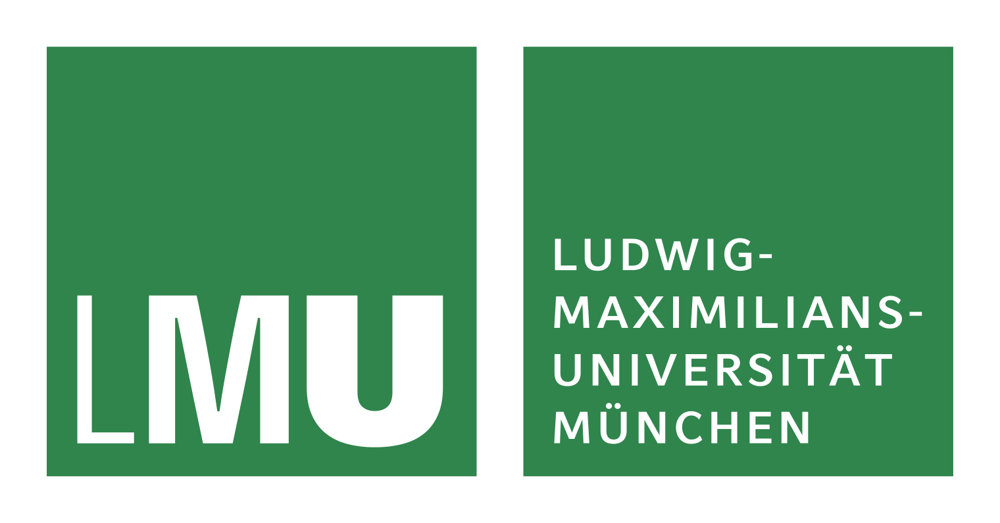

### TA3 `r emo::ji("heart")` Math and Fair Data


.pull-left-30[
.center[
```{r, echo=FALSE}

```

```{r, echo=FALSE, out.width="90%"}


```    

```{r, echo=FALSE, out.width="75%"}


```    
]

]

.pull-right-70[
<br>

__Bernd Bischl__, Giuseppe Casalicchio, Sebastian Fischer
<br>
<br>
<br>
<br>
<br>

__Mathias Drton__, Stephan Haug, Oleksandr Zadorozhnyi
<br>
<br>
<br>
<br>
<br>
<br>

__Karsten Tabelow__, N.N. 
]


???

Drton
.small[Chair of Mathematical Statistics    
MaRDI Co-Spokesperson     
Core Member of MDSI    
ELLIS Munich Faculty]

Bischl  
.small[
Chair of Statistical Learning & Data Science    
MaRDI Co-Spokesperson     
Co-Director of MCML    
ELLIS Munich Faculty]

---

### Work program of TA3

.yb[M3.1: Library of Curated Benchmark Datasets]    
.small[__Aim:__ provide _task-specific_ libraries of curated benchmark datasets following FAIR principles ]


.yb[M3.2: Library of Statistical Analyses]    
.small[__Aim:__ provide exhaustive statistical analysis of the datasets from M3.1, which will be demos that connect the data to statistical methods] 

.yb[M3.3: Empirical Analysis of Machine Learning Experiments]    
.small[__Aim:__ provide (tools to analyze) results of benchmark experiments of the datasets from M3.1; summarize common pitfalls and list guideline to avoid those pitfalls]

.yb[M3.4: Standards for Peer Review of Numerical Experimentation]     
.small[__Aim:__ establish standards for peer-review of numerical experiments as well as the software code with which the experiments are conducted]

---

### Work program of TA3


__M3.1 to M3.3__ use, adapt [OpenML](https://new.openml.org/)

```{r, echo=FALSE}
knitr::include_url("https://new.openml.org/", height = "350px")
```


create a connection to the [MaRDI portal](https://portal.mardi4nfdi.de/wiki/Portal) and make all results extendable by the community.

